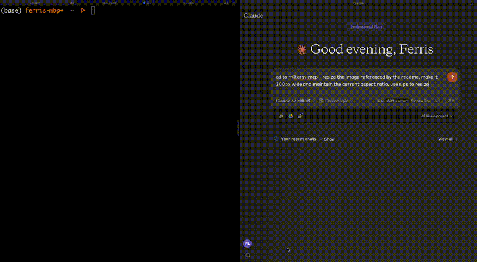

# iterm-mcp 
A Model Context Protocol server that provides access to your iTerm session.

### Features

- **Efficient Token Use**: Only the visible content of the terminal is passed to the model. The model can retrieve content that's not visible if necessary.
- **Supports Long-Running Processes**: iterm-mcp knows when the terminal is waiting for user input. Long-running processes are handled gracefully.
- **Interrupt When Needed**: Send control characters to the terminal to interrupt processes.
- **Inspect Terminal Activity**: Gives the model visibility into the current terminal content.

<a href="https://glama.ai/mcp/servers/h89lr05ty6"></a>

### Tools
- `write_to_terminal` - Writes to the active iTerm terminal, often used to run a command.
- `read_terminal_output` - Reads the output from the active iTerm terminal.
- `send_control_character` - Sends a control character to the active iTerm terminal.

## Installation

To use with Claude Desktop, add the server config:

On macOS: `~/Library/Application Support/Claude/claude_desktop_config.json`
On Windows: `%APPDATA%/Claude/claude_desktop_config.json`

```json
{
  "mcpServers": {
    "iterm-mcp": {
      "command": "npx",
      "args": [
        "-y",
        "iterm-mcp"
      ]
    }
  }
}
```

### Installing via Smithery

To install iTerm for Claude Desktop automatically via [Smithery](https://smithery.ai/server/iterm-mcp):

```bash
npx -y @smithery/cli install iterm-mcp --client claude
```
[](https://smithery.ai/server/iterm-mcp)

## Development

Install dependencies:
```bash
yarn install
```

Build the server:
```bash
yarn run build
```

For development with auto-rebuild:
```bash
yarn run watch
```

### Debugging

Since MCP servers communicate over stdio, debugging can be challenging. We recommend using the [MCP Inspector](https://github.com/modelcontextprotocol/inspector), which is available as a package script:

```bash
yarn run inspector
yarn ts-node --esm test/CommandExecutor.test.ts
```

The Inspector will provide a URL to access debugging tools in your browser.
